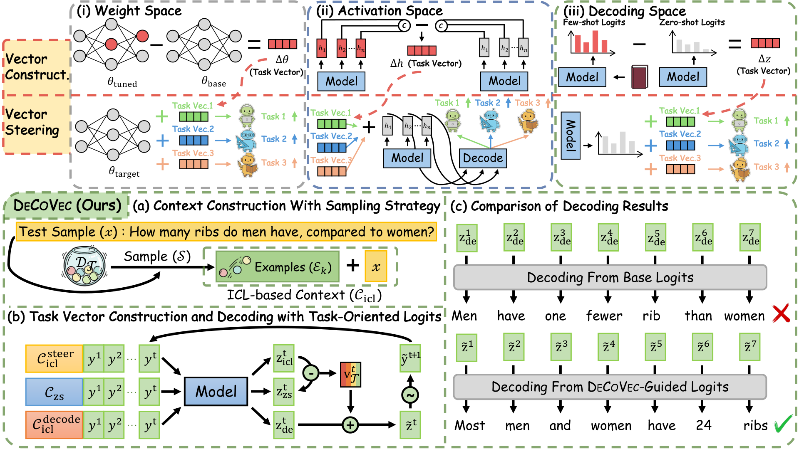

# DeCoVec: Building Decoding Space based Task Vector for Large Language Models via In-Context Learning

[](https://2026.aclweb.org/)

This repository contains the code for our paper **DeCoVec** (ACL 2026 Findings).

## New

- **[2026/04/13]** Our paper has been accepted to **ACL 2026 Findings**.

## Overview

**DeCoVec** (**Dec**oding-space task vector via **Co**ntrastive ICL) builds a task vector in **output logit space** with **ICL**: contrast **few-shot** vs **zero-shot** logits each step, then **add** that vector at decode time. Unlike vectors in **weights** or **hidden activations**, it is **training-free** and **non-invasive** (no fine-tuning, no internal hooks).

<div align="center">
  
  <br>
</div>

## Key Features

- **Training-free & non-invasive**: no weight updates or activation-space optimization; logits-only steering.
- **Decoding-space Δz**: task signal as the difference between ICL and zero-shot **distributions** at the decoder output.
- **Solid empirical gains**: seven LLMs (0.5B–9B) on TruthfulQA, Math-500, and AQUA-RAT—**consistent** lifts over few-shot baselines (up to **+5.50** avg accuracy in our runs).
- **Lightweight**: no extra input tokens beyond your chosen ICL prefix; robust to demonstration ordering in our analyses.

### Key Idea

DeCoVec constructs task vectors by contrasting the output logit distributions between few-shot ICL context and zero-shot context:

```
v_T^t = z_icl^t - z_zs^t
```

Then steers generation by injecting the task vector into the decoding process:

```
z_tilde^t = z_de^t + λ · v_T^t
```

## 📊 Main Results

Performance improvements over few-shot baselines across different models and tasks:

| Model | TruthfulQA (Avg Δ) | Math-500 (Avg Δ) | AQUA-RAT (Avg Δ) |
| :--- | :--- | :--- | :--- |
| **Qwen2-0.5B** | +1.58% | +0.88% | +4.14% |
| **Qwen2-1.5B** | +1.20% | +2.44% | +4.53% |
| **Qwen2-7B** | +1.47% | +2.73% | +2.07% |
| **Yi-6B** | +2.41% | +1.21% | +2.56% |
| **Llama-2-7B** | +2.31% | +3.62% | +1.28% |
| **Llama-3-8B** | +1.41% | +0.98% | +3.44% |
| **Gemma-2-9B** | +1.22% | +3.22% | +2.56% |

See paper Table 2 for complete results.

## 🔧 Installation

### Requirements

- Python 3.8+
- PyTorch 2.0+
- CUDA 11.8+ (for GPU acceleration)

### Setup

```bash
# Clone the repository
git clone https://github.com/Liflysheep/DeCo.git
cd DeCo

# Install dependencies
pip install -r requirements.txt

# Download pre-trained models (optional, will auto-download on first run)
bash download_models.sh
```

## 🚀 Quick Start

### Basic Usage

```bash
# Run DeCoVec on TruthfulQA with Qwen2-7B
python run_decovec.py \
    --dataset truthfulqa \
    --model qwen2-7b \
    --mode test_scale \
    --icl_method kate \
    --n_shot 20

# Run on Math-500
python run_decovec.py \
    --dataset math500 \
    --model qwen2-7b \
    --mode test_scale \
    --icl_method kate \
    --n_shot 2
```

### Configuration

Edit `simple_config.py` to customize:
- Model selection
- Dataset paths
- Hyperparameters (λ, etc.)

Key hyperparameters:
- `lambda_scale`: Scaling factor for task vector
- `n_shot`: Number of ICL demonstrations (15 for TruthfulQA, 10 for reasoning tasks)

## 📁 Project Structure

```
DeCo/
├── decovec/                    # Core implementation
│   ├── decovec_core.py        # Main algorithm
│   ├── decovec_processor.py   # LogitsProcessor for HuggingFace
│   ├── task_vector_builder.py # Task vector construction
│   ├── demonstration_sampler.py # ICL example selection
│   └── ...
├── data/                       # Datasets
│   ├── truthfulqa/
│   ├── math500/
│   └── aqua_rat/
├── evaluate/                   # Evaluation metrics
├── docs/                       # Documentation
├── run_decovec.py             # Main entry point
├── simple_config.py           # Configuration
└── README.md
```

## 🔬 Reproduce Paper Results

### Main Experiments (Table 2)

```bash
# Test different λ values on TruthfulQA
python run_decovec.py \
    --mode test_scale \
    --dataset truthfulqa \
    --model qwen2-7b \
    --lambda_values 1.0 \
    --n_shot 20

# Test on Math-500
python run_decovec.py \
    --mode test_scale \
    --dataset math500 \
    --model qwen2-7b \
    --lambda_values 0.2,0.4,0.6,0.8,1.0 \
    --n_shot 2
```

## 📖 Documentation

- [API Documentation](docs/API.md)

## Citation

If you use this code or our method, please cite the camera-ready version once it appears on the ACL Anthology. A minimal BibTeX entry (update `author`, `pages`, and `url` from the official proceedings entry when available):

```bibtex
@inproceedings{decovec-acl26findings,
  title = {{DeCoVec}: Building Decoding Space based Task Vector for Large Language Models via In-Context Learning},
  booktitle = {Findings of the Association for Computational Linguistics: ACL 2026},
  year = {2026},
  publisher = {Association for Computational Linguistics},
  url = {https://github.com/szu-tera/DeCoVec.git}
}
```


